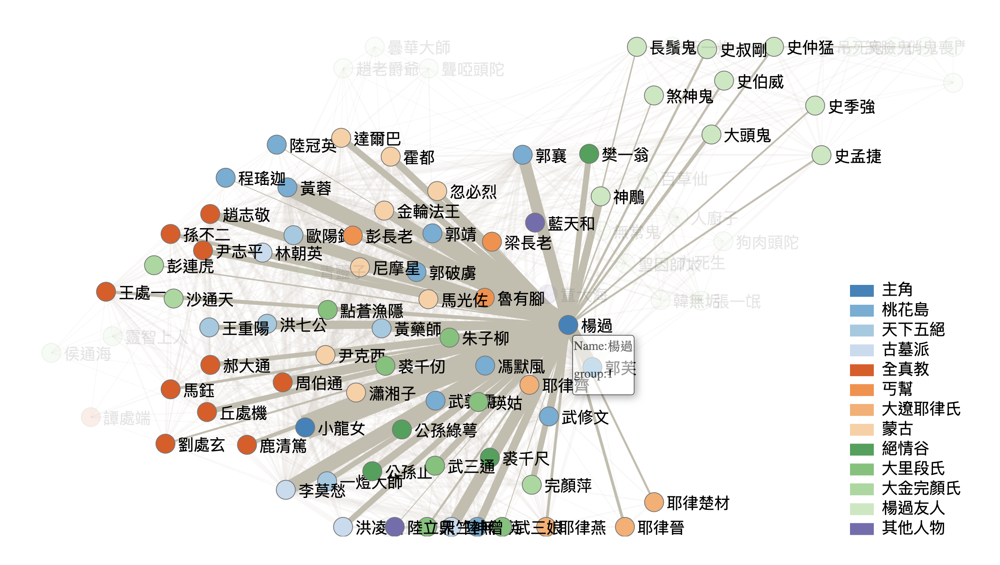
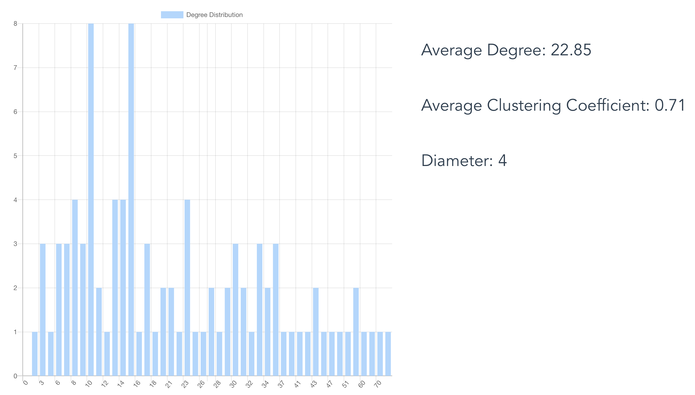
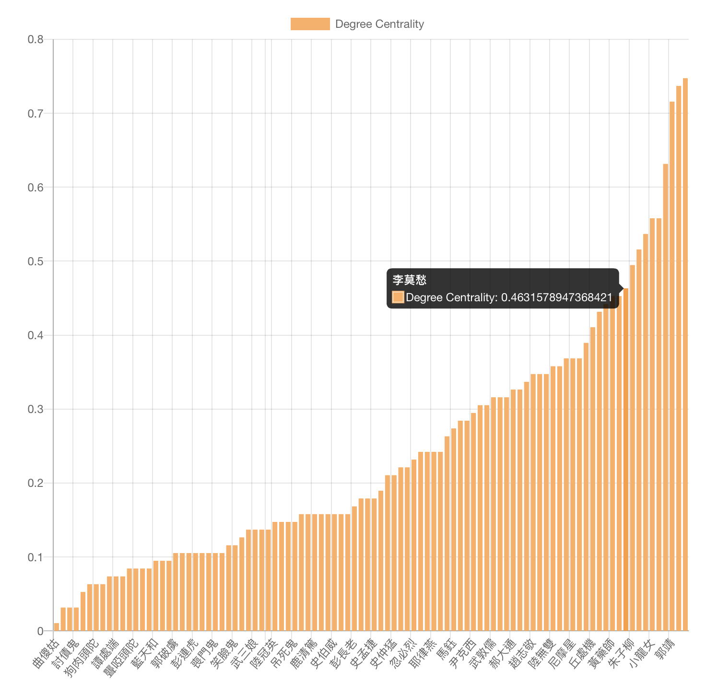
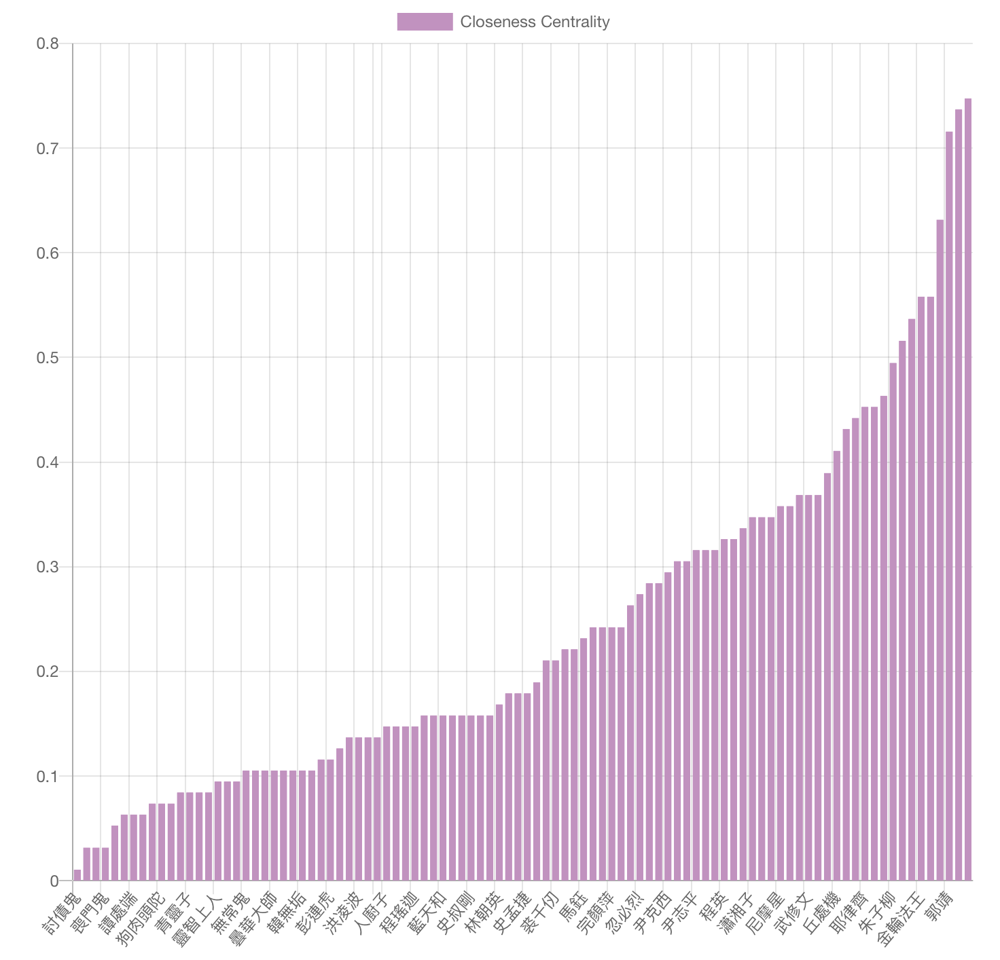

# Novel analysis 神鵰俠侶小說分析

This project is assignment 2 of course `Social Network and Computing` in National Chung Hsing University, department of computer science and engineering. The aims of this project are to show the relationship between all the roles in the novel. Moreover, this project calculate the average degree, average clustering coefficient, diameter and degree distribution of the characters.

## Getting Started

Dataset introduction

* Novel : 神鵰俠侶
* Node : Character
* Edge : show in the same paragraph 
* Node numbers : 96
* Edges number: 3,160,000+

<!--More detailed information about the dataset and the file can be find in [this website](https://snap.stanford.edu/data/web-Google.html).-->

### Prerequisites

What things you need to install the software and how to install them

* npm
* NodeJs
* VueJs
* vue-chartjs

	```
	$npm install vue-chartjs
	```

* full-fullpage.js
	
	```
	$sudo npm install --save vue-fullpage.js
	```

## Run the code

The source codes are under the `/src` folder. Here is an example to run the code.

* Python code

	```
	Example
	$python read_relationship.py
	```
* Webpage

	```
	#install dependencies
	npm install

	#serve with hot reload at localhost:8080
	npm run dev

	# build for production with minification
	npm run build
	```

## Results of this project
* Relationship figure of all characters



* Average degree: 22.8
* Undirected diameter: 4
* Average clustering coefficient: 0.71
* Degree distribution image



* Degree centrality
* 


* Closeness centrality
* 


## Authors

* **Chun-Hung, Fan**
* **Tai-Lin, Chiu** -- [github](https://github.com/niLiaT)

## License

This project is licensed under the MIT License